|  | Algorithm and Data Structure |
|--|--|
| NIM |  244107020027 |
| Nama |  Muhammad Rayhan Zamzami |
| Kelas | TI - 1H |
| Repository | [link] (https://github.com/mrayhanz/Algorithm-Data-Structure) |

# Labs #10  QUEUE

## Percobaan 1

### 2.1.2 Verifikasi Hasil Percobaan
 
  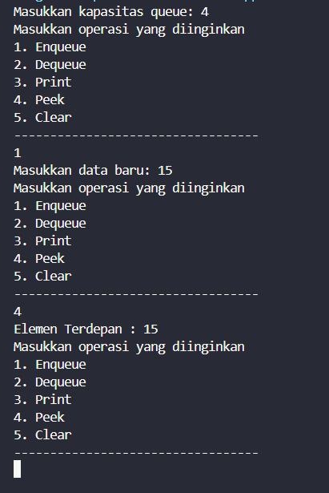

### 2.1.3 Pertanyaan

1. `front` dan `rear = -1` menandakan antrian kosong, `size = 0` karena belum ada data.

2. Kode tersebut digunakan untuk **membuat antrian melingkar**. Jika `rear` sudah di akhir array (`max - 1`), maka di-reset ke 0 agar bisa mengisi dari awal lagi.

3. Kode tersebut untuk **antrian melingkar**. Jika `front` sudah di akhir array, maka di-reset ke 0 agar bisa lanjut ke awal array.

4. Karena data antrian dimulai dari posisi `front`, bukan dari indeks 0. Jadi, `i = front` agar mencetak data sesuai urutan antrian.

5. Kode `i = (i + 1) % max` digunakan untuk **iterasi melingkar**. Jika `i` sudah di indeks terakhir, ia kembali ke 0.

6. Potongan kode yang menunjukkan **queue overflow** ada di method `Enqueue`:

```java
if (isFull()) {
    System.out.println("Queue sudah penuh");
}
```

7. Modifikasi 
```java
        if (isFull()) {
            return;
        }
```

```java
        if (isEmpty()) {
            System.out.println("Queue masih kosong");
            return -1;
        }
```

## Percobaan 2

### 2.2.2 Verifikasi Hasil Percobaan

  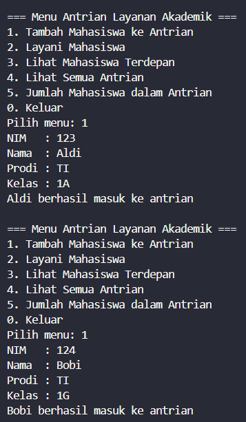
  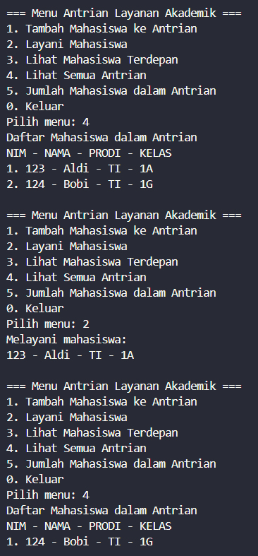
  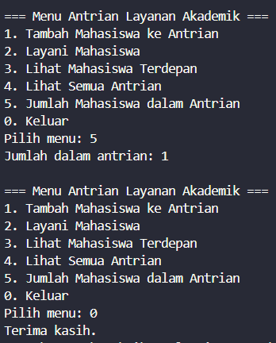

### 2.2.3 Pertanyaan

Modifikasi 
```java
    void lihatAkhir() {
        if (isEmpty()) {
            System.out.println("Antrian kosong");
        } else {
            System.out.println("Mahasiswa paling belakang : ");
            System.out.println("NIM - NAMA - PRODI - KELAS");
            data[rear].tampilkanData();
        }
    }
```
```java
    System.out.println("6. Cek Antrian paling belakang");
```
```java
    case 6:
        antrian.lihatAkhir();
        break; 
```

## Tugas

  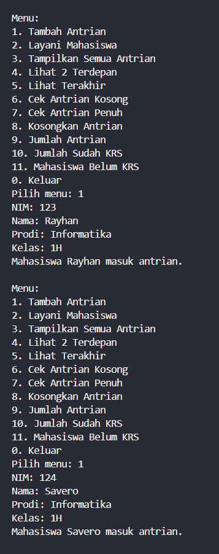
  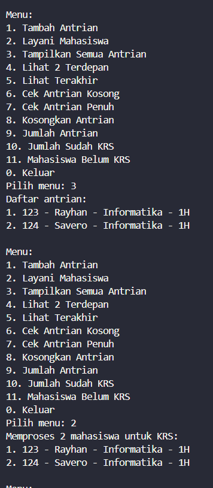
  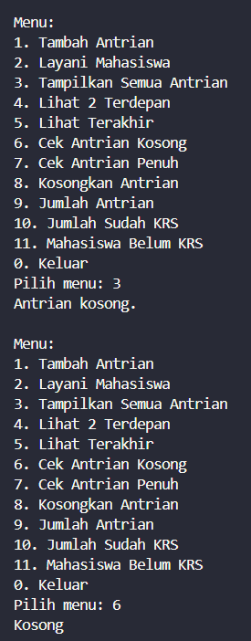
  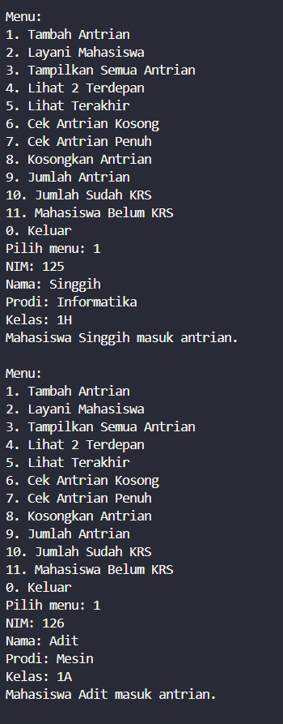
  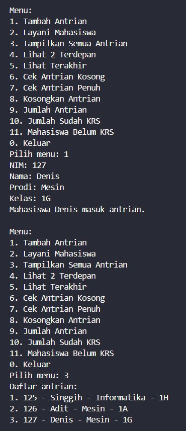
  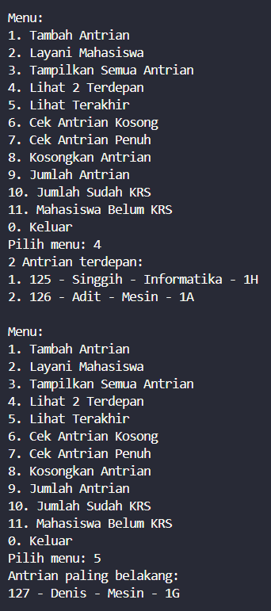
  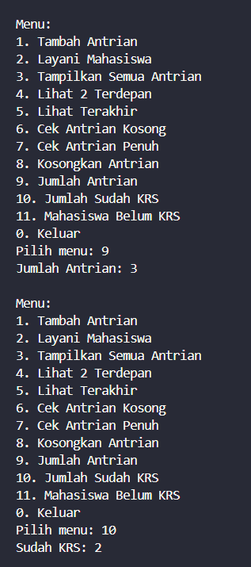
  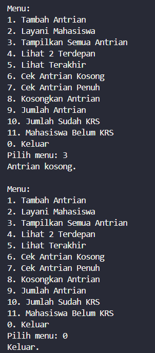