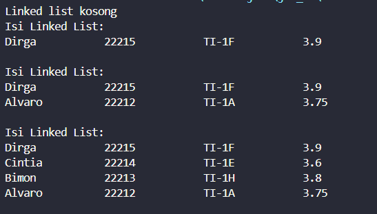
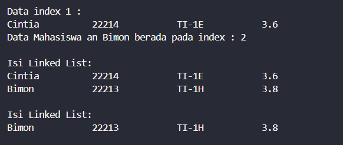
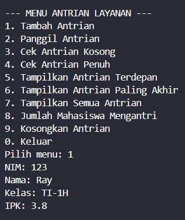
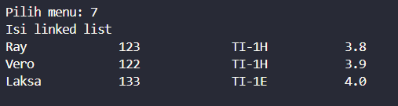
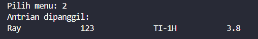
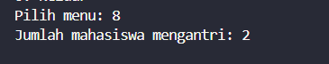
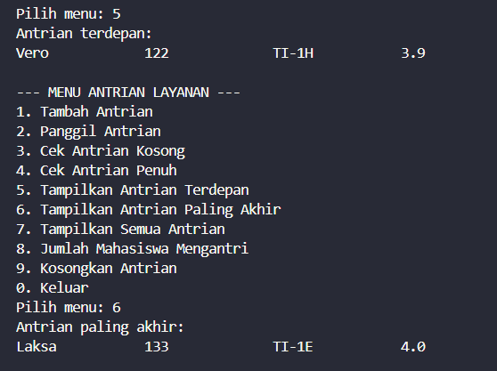
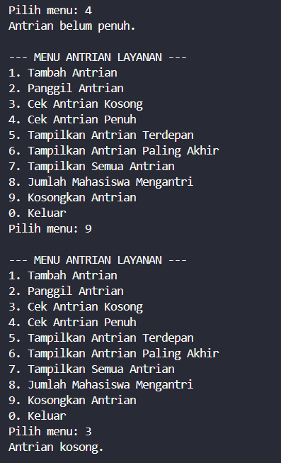

|  | Algorithm and Data Structure |
|--|--|
| NIM |  244107020027 |
| Nama |  Muhammad Rayhan Zamzami |
| Kelas | TI - 1H |
| Repository | [link] (https://github.com/mrayhanz/Algorithm-Data-Structure) |

# Labs #11  LINKED LIST

## Percobaan 1

### 2.1.1 Verifikasi Hasil Percobaan
 
  

### 2.1.2 Pertanyaan

1. Hasil "Linked List Kosong" muncul karena saat `print()` dipanggil, linked list baru dibuat dan belum ada node yang ditambahkan, sehingga kondisi `head == null` terpenuhi.

2. `temp` digunakan sebagai pointer sementara untuk menelusuri atau memproses node dalam linked list, seperti saat mencetak, menambah, atau menghapus data, tanpa mengubah posisi `head`.

3. 
```java
        Scanner sc = new Scanner(System.in);
        SingleLinkedList17 ssl = new SingleLinkedList17();
        int jumlah;

        System.out.print("Masukkan jumlah mahasiswa: ");
        jumlah = sc.nextInt();
        sc.nextLine(); 

        for (int i = 0; i < jumlah; i++) {
            System.out.println("Data Mahasiswa ke-" + (i + 1));
            System.out.print("Nama: ");
            String nama = sc.nextLine();
            System.out.print("NIM: ");
            System.out.print("Kelas : ");
            String kelas = sc.nextLine();
            String nim = sc.nextLine();
            System.out.print("IPK: ");
            double ipk = sc.nextDouble();
            sc.nextLine(); 

            Mahasiswa17 mhs = new Mahasiswa17(nama, nim, kelas, ipk);
            ssl.addLast(mhs);
        }

        System.out.println("Data Mahasiswa:");
        ssl.print();
    }
```

## Percobaan 2

### 2.2.1 Verifikasi Hasil Percobaan

  

### 2.2.2 Pertanyaan

1. Keyword `break` digunakan pada fungsi `remove` untuk menghentikan perulangan setelah node yang dicari berhasil ditemukan dan dihapus, agar program tidak terus menelusuri node yang lain secara sia-sia.

2. Kode `temp.next = temp.next.next;` menghapus node dengan melewati node target.  
`if (temp.next == null) { tail = temp; }` memastikan `tail` diperbarui jika node terakhir dihapus.

## Tugas

1. Tambah Antrian

  

2. Semua Antrian

  

3.  Memanggil Antrian

  

4. Jumlah Antrian

  

5. Cek Antrian Depan dan akhir

  

6. Cek antrian penuh, kosongkan lalu cek antrian kosong

  
