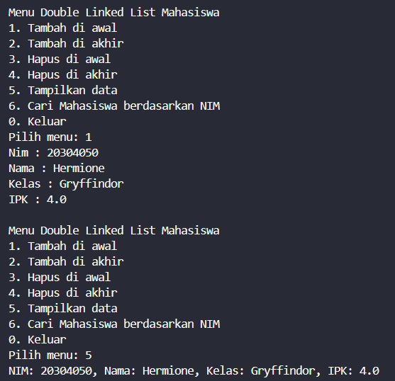
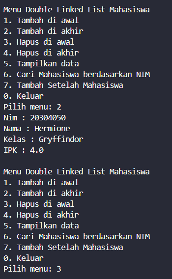
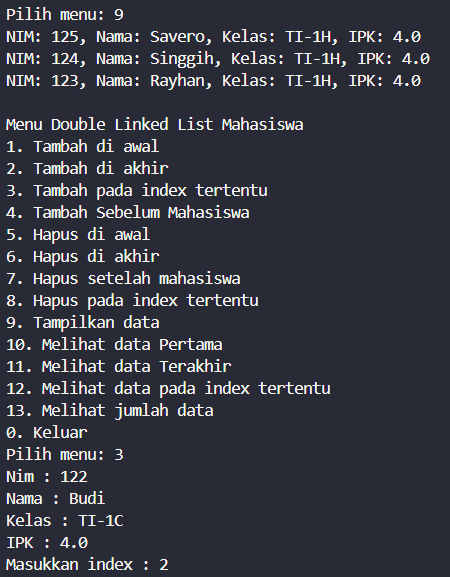
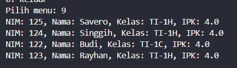
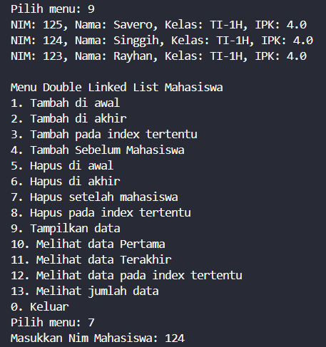
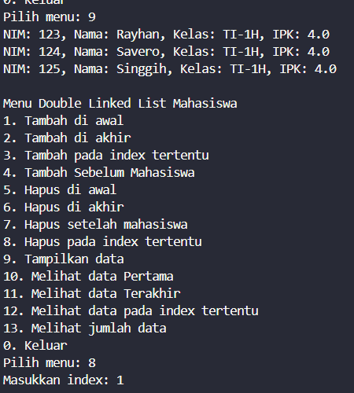
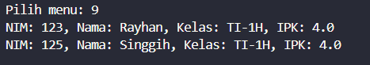
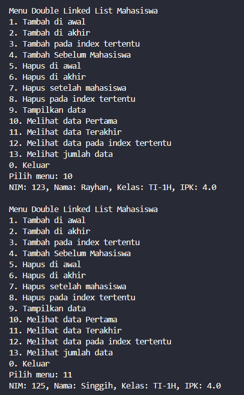
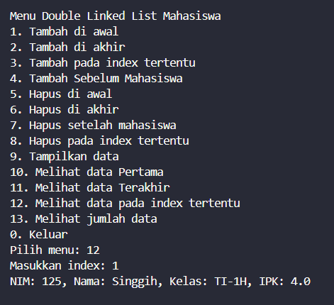

|  | Algorithm and Data Structure |
|--|--|
| NIM |  244107020027 |
| Nama |  Muhammad Rayhan Zamzami |
| Kelas | TI - 1H |
| Repository | [link] (https://github.com/mrayhanz/Algorithm-Data-Structure) |

# Labs #12  DOUBLE LINKED LIST

## Percobaan 1

### 12.2.2 Verifikasi Hasil Percobaan
 
  

### 12.2.3 Pertanyaan

1. Single Linked List hanya punya satu arah: setiap node menyimpan data dan `next` (penunjuk ke node berikutnya). Kalau Double Linked List punya dua arah: setiap node menyimpan data, `next`, dan `prev` (penunjuk ke node sebelumnya), sehingga traversal bisa maju dan mundur.

2. Atribut `next` digunakan untuk menunjuk ke node berikutnya, sedangkan `prev` untuk menunjuk ke node belumnya dalam double linked list. Ini memungkinkan traversal dua arah.

3. Konstruktor tersebut digunakan untuk menginisialisasi linked list kosong dengan mengatur `head` dan `tail` ke `null`, artinya belum ada node dalam list saat dibuat.

4. Kode itu berarti: jika list kosong, maka node baru menjadi head dan tail sekaligus, karena hanya ada satu node dalam list.

5. Statement `head.prev = newNode` berarti node baru akan menjadi sebelum head lama, jadi kita hubungkan head lama ke node baru lewat pointer `prev`.

6. 
```java
public void print() {
    if (isEmpty()) {
        System.out.println("Linked list masih kosong.");
    } else {
        Node17 tmp = head;
        while (tmp != null) {
            System.out.println(tmp.data);
            tmp = tmp.next;
        }
    }
}
 
```

7. Kode `current.next.prev = newNode;` berarti node setelah `current` akan menunjuk kembali ke `newNode` sebagai node sebelumnya, untuk menjaga keterkaitan dua arah pada double linked list.

8. Modifikasi
```java
                case 7 -> {
                    Mahasiswa17 mhs = inputMahasiswa();
                    System.out.print("Masukkan nama mahasiswa : ");
                    String namaMhs = scan.next(); 
                    list.insertAfter(namaMhs, mhs);
                }
```

### 12.3.2 Verifikasi Hasil Percobaan

  

### 12.3.3 Pertanyaan

1. Kode tersebut memindahkan `head` ke node berikutnya, lalu memutus koneksi ke node lama agar node pertama dihapus dengan benar.

2. Modifikasi : 
- Remove First 
```java
        System.out.println("Node berhasil dihapus");
        System.out.println("Data yang terhapus adalah : " + head.data);
```

- Remove Last 
```java
        System.out.println("Node berhasil dihapus");
        System.out.println("Data yang terhapus adalah : " + tail.data);
```

## Tugas

1. Fungsi `add()`

  


  

2. Fungsi `removeAfter()`

  

  

3. Fungsi `remove()`

  
  
  

4. Fungsi `getFirst()`, `getLast()`, `getIndex()`

  
  
  

5. Fungsi `getSize()`

  
  


