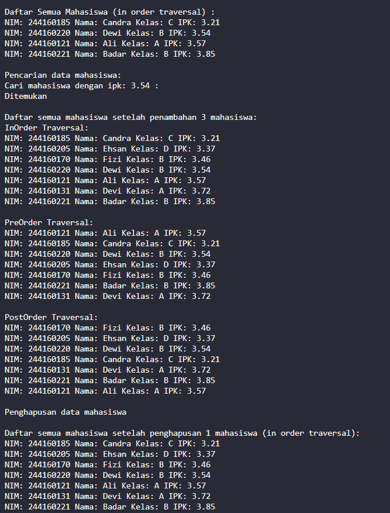
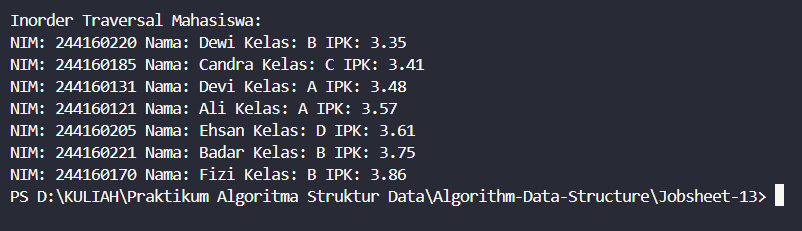
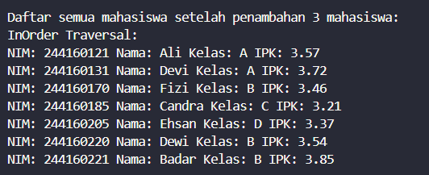
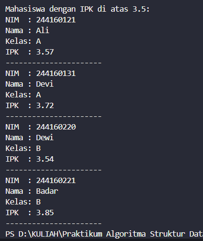
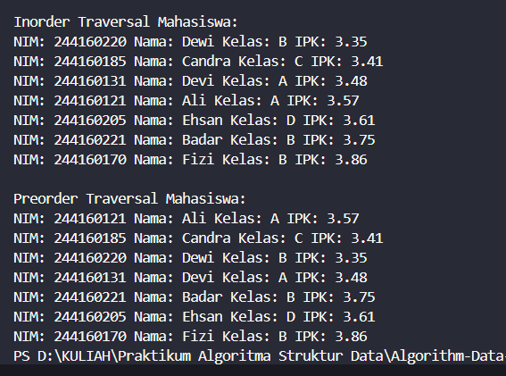

|  | Algorithm and Data Structure |
|--|--|
| NIM |  244107020027 |
| Nama |  Muhammad Rayhan Zamzami |
| Kelas | TI - 1H |
| Repository | [link] (https://github.com/mrayhanz/Algorithm-Data-Structure) |

# Labs #13  Tree

## Percobaan 1

### 14.2.1 Verifikasi Hasil Percobaan
 
  

### 14.2.2 Pertanyaan

1. BST lebih efisien karena data terurut, sehingga pencarian bisa langsung ke kiri atau kanan tanpa menelusuri semua node.
2. Atribut `left` dan `right` di class `Node` digunakan untuk menunjuk ke **anak kiri** dan **anak kanan** dalam struktur pohon biner. Mereka membentuk hubungan antar node dan memungkinkan traversal pohon ke dua arah tersebut.
3. Pertanyaan ganda : 
  - Atribut root di class BinaryTree digunakan sebagai titik awal (node utama) dari pohon. Semua operasi seperti pencarian, penambahan, dan traversal dimulai dari root.
  - Saat objek tree pertama kali dibuat, nilai dari root adalah null, karena pohon belum memiliki node apa pun.

4. Saat tree masih kosong (`root == null`) dan akan ditambahkan node baru, proses yang terjadi adalah:
Node baru akan langsung menjadi root dari tree.

5. Baris tersebut mencari posisi penempatan node baru di BST. Jika IPK lebih kecil dari node saat ini, pindah ke kiri jika tidak, ke kanan. Jika posisi kiri/kanan kosong, node baru ditempatkan di sana.

6. Saat menghapus node dengan dua anak, program mencari node tersebut, lalu menggunakan `getSuccessor()` untuk menemukan node terkecil di subtree kanannya. Node ini menjadi pengganti (successor) agar struktur BST tetap terurut. Setelah itu, nilai node yang dihapus diganti dengan successor, dan node successor dihapus dari posisi lamanya.

## Percobaan 2

### 14.3.1 Verifikasi Hasil Percobaan

  

### 14.3.2 Pertanyaan

1. Atribut `data` menyimpan elemen-elemen node dalam bentuk array sesuai urutan level binary tree, sedangkan `idxLast` menunjukkan indeks terakhir yang terisi, digunakan untuk menambah node baru dan melacak posisi elemen dalam tree.

2. Method `populateData()` digunakan untuk mengisi array `data` pada binary tree dengan elemen awal, sekaligus mengatur `idxLast` sesuai jumlah elemen yang dimasukkan, sehingga tree siap digunakan untuk operasi selanjutnya.

3. Method `traverseInOrder()` digunakan untuk menelusuri dan mencetak elemen-elemen tree secara **in-order**, yaitu: **kiri -> root -> kanan**. Ini menghasilkan output elemen dalam urutan yang **terurut** jika tree adalah Binary Search Tree.

4. Kalau node ada di indeks 2, maka left child-nya ada di indeks 5 dan right child-nya di indeks 6, sesuai rumus 2i+1 dan 2i+2.

5. Statement `int idxLast = 6` digunakan untuk menunjukkan bahwa elemen terakhir dalam array binary tree berada di indeks ke-6, sehingga traversal atau penambahan data hanya dilakukan sampai posisi tersebut.

6. Indeks `2*idxStart+1` dan `2*idxStart+2` digunakan karena itu adalah rumus untuk menentukan posisi **anak kiri** dan **anak kanan** dalam representasi **pohon biner menggunakan array**. Rumus ini menjaga hubungan struktur tree dalam bentuk linear, sehingga traversal dan manipulasi node bisa dilakukan langsung lewat indeks tanpa pointer.

## Tugas

1. Method `addRekursif()`

  
  
2. Method mencari `minIpk` & `maxIpk`

  

3. Method `tampilMahasiswaIPKdiAtas()`

  

4. Method `addData()` & `preOrderTraverse()`

  
