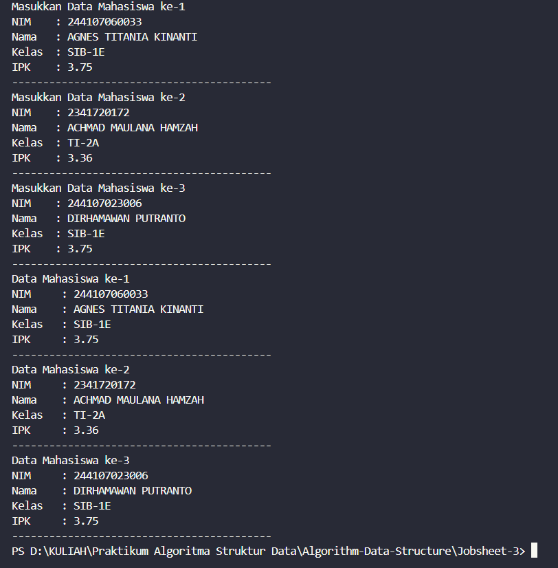
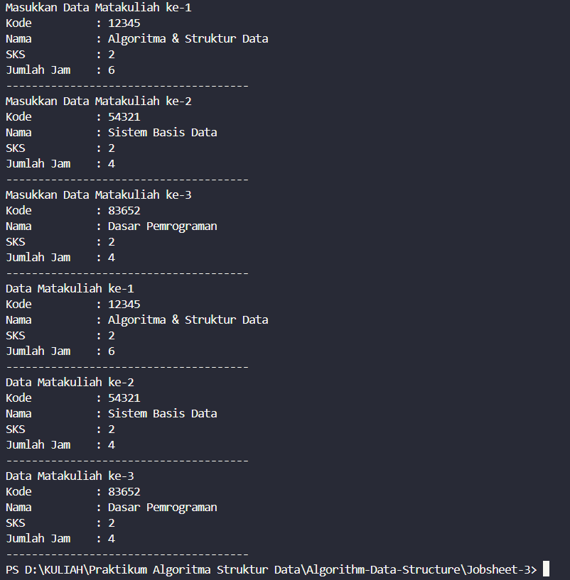

|  | Algorithm and Data Structure |
|--|--|
| NIM |  244107020027 |
| Nama |  Muhammad Rayhan Zamzami |
| Kelas | TI - 1H |
| Repository | [link] (https://github.com/mrayhanz/Algorithm-Data-Structure) |

# Labs #3 Array Of Object

## Percobaan 1

### 3.2.2 Verifikasi Hasil Percobaan 

 


### 3.2.3 Pertanyaan
1. Tidak, karena class pada array of object tidak selalu harus memiliki atribut dan method sekaligus,bisa jadi class dengan atribut saja jika class hanya untuk menyimpan data,maka cukup memiliki atribut tanpa method.
2. Melakukan inisialisasi array dengan tipe data sebuah class, dengan jumlah elemen 3.
3. class ```Mahasiswa17``` tidak memiliki kontruktor,tetapi secara default jika kita membuat class tanpa konstruktor maka otomatis akan membuat konstruktor default tanpa parameter sehingga objek tetap dapat di instansiasi.
4. Kode tersebut mengisi nilai pada seluruh atribut yang ada di dalam object array yang berindex 0.
5. Dipisahkan Karena class ```MahasiswaDemo17```berisi method main dan pada ```java``` method main harus dalam sebuah public class dengan memiliki nama yang sama dengan nama file.

## Percobaan 2

### 3.3.2 Verifikasi Hasil Percobaan 

 


### 3.3.3 Pertanyaan
1. 
``` java
    void cetakinfo(){
        System.out.println("NIM     : " + nim);
        System.out.println("Nama    : " + nama);
        System.out.println("Kelas   : " + kelas);
        System.out.println("IPK     : " + ipk);
    }
```
``` java
        for (int i = 0; i < 3; i++) {
            System.out.println("Data Mahasiswa ke-" + (i+1));
            arrayOfMahasiswa[i].cetakinfo();
            System.out.println("------------------------------------------");
        }
```
2. Karena objek pada index 0 belum di instansiasi.


## Percobaan 3

### 3.4.2 Verifikasi Hasil Percobaan 

 


### 3.4.3 Pertanyaan
1.