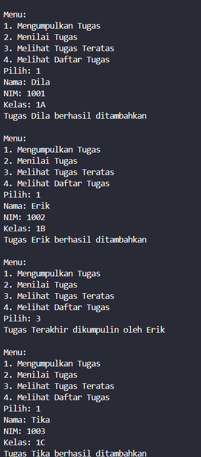
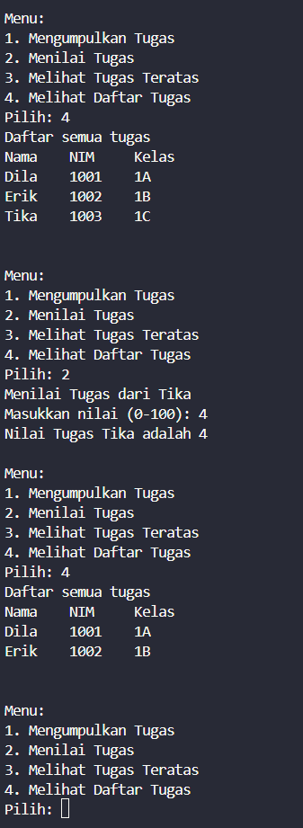
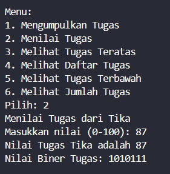
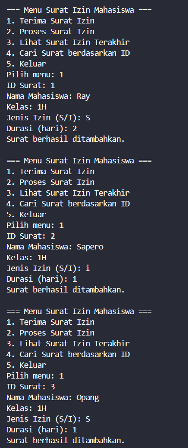
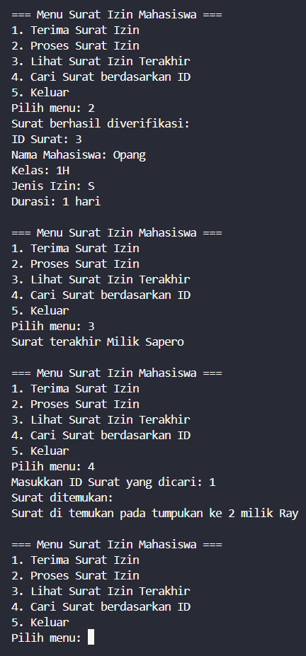

|  | Algorithm and Data Structure |
|--|--|
| NIM |  244107020027 |
| Nama |  Muhammad Rayhan Zamzami |
| Kelas | TI - 1H |
| Repository | [link] (https://github.com/mrayhanz/Algorithm-Data-Structure) |

# Labs #9  STACK

## Percobaan 1

### 2.1.2 Verifikasi Hasil Percobaan
 
  

  


### 2.1.3 Pertanyaan

1. Perubahan Kode
  ```java
    public void print() {
        for(int i = top; i >= 0; i--) {
            System.out.println(stack[i].nama + "\t" + stack[i].nim + "\t" + stack[i].kelas);
        }
        System.out.println("");
    }
  ```

2. Sejumlah data yang inputkan saat menginisiasi objek ```StackTugasMahasiswa17```
```java
        StackTugasMahasiswa17 stack = new StackTugasMahasiswa17(5);
```

3. Pengecekan `!isFull()` mencegah penambahan data saat stack penuh. Tanpa itu, program bisa crash karena akses indeks di luar batas array.

4. Tambahkan Method & modifikasi ```MahasiswaDemo17```
```java
    public Mahasiswa17 bottom() {
        if (!isEmpty()) {
            return stack[0];
        } else {
            System.out.println("Stack kosong! Tidak ada tugas.");
            return null;
        }
    }
```
```java
                case 5:
                    Mahasiswa17 terbawah = stack.bottom();
                    if (terbawah != null) {
                        System.out.println("Tugas Terbawah dikumpulin oleh " + terbawah.nama);
                    }
            }

        } while (pilih >= 1 && pilih <= 5);
        
```

5. Modifikasi 
```java
    public int jumlahTugas() {
        return top + 1;
    }
```

### 2.2.2  Verifikasi Hasil Percobaan

  

### 2.2.3 Pertanyaan

1. Method `konversiDesimalKeBiner` mengubah angka desimal menjadi biner dengan membagi angka secara berulang dengan 2 dan menyimpan sisa pembagian ke dalam stack. Setelah nilai habis dibagi, method mengambil kembali isi stack (yang berisi 0 atau 1) dari atas ke bawah untuk membentuk representasi biner dalam bentuk string, lalu mengembalikannya sebagai hasil.

2. Mengganti `while (nilai > 0)` dengan `while (nilai != 0)` menghasilkan output yang sama untuk nilai positif, tetapi berisiko infinite loop jika nilai negatif masuk, karena tidak akan pernah menjadi nol.


## Latihan Praktikum

  

  
